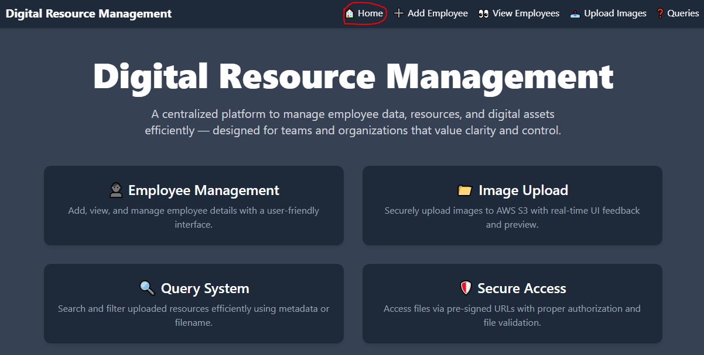

 # Digital Resource Management System

## Home page 

This page provides an overview of the DRMS project. It also includes a navigation bar with links to various features such as Add Employee, View Employee, Upload Images, and Query Images.

## Add employee page  

In this section, an employee can be added by providing their name. The employee ID and creation time are automatically generated.

## View Employee 

This page displays detailed information of all employees.  
It includes:
- **Edit** button: Allows updating the employee's name.  
- **Delete** button: Allows removing a specific employee.

## Upload image 

This section enables image uploads linked to a specific employee.  
After a successful upload:
- A confirmation message is shown.  
- Detected tag(s) from the image are displayed.

## Query images 

When no tags or employee ID are provided during search, information for **all images** is displayed.

Searching with only tags

Searching with tags as well as employeeId

When tags or an employee ID are specified, only the images related to the corresponding tags or employee ID are shown.

 